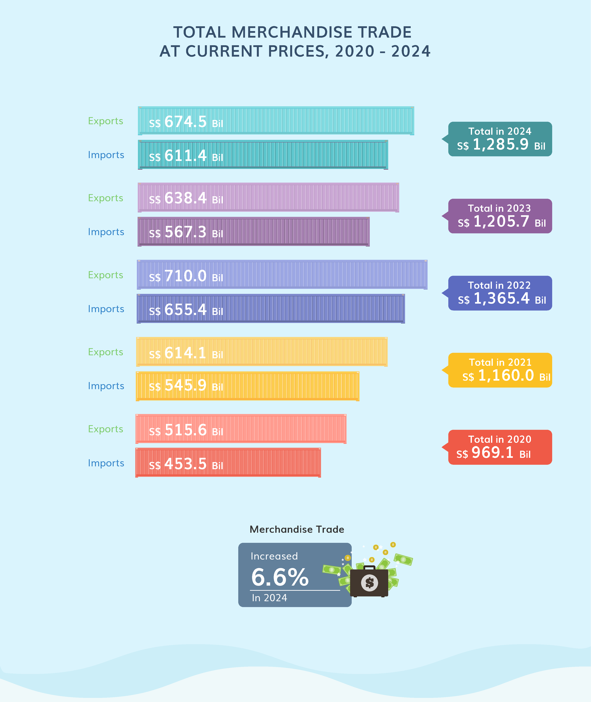
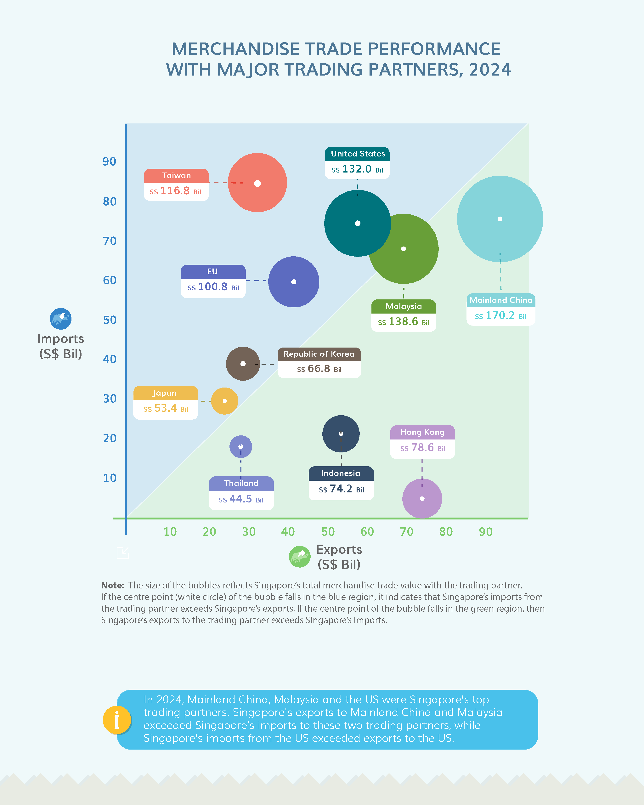
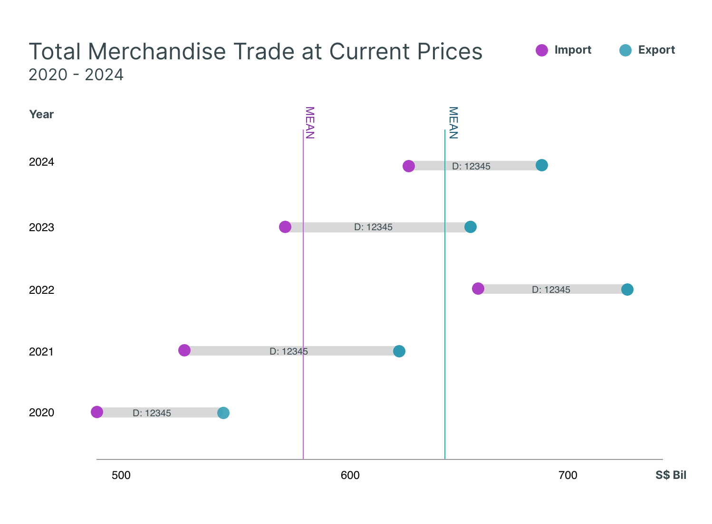
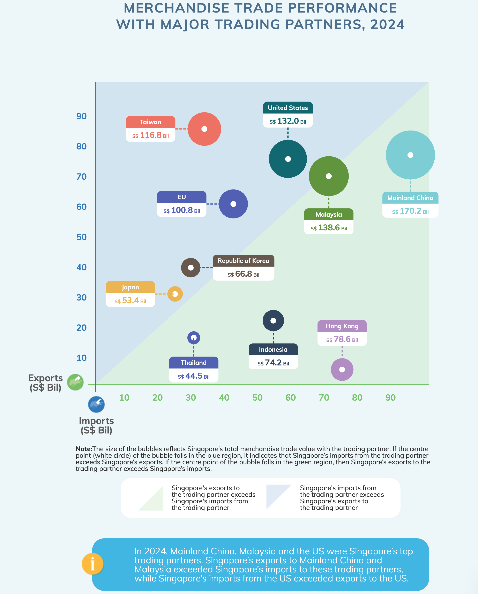
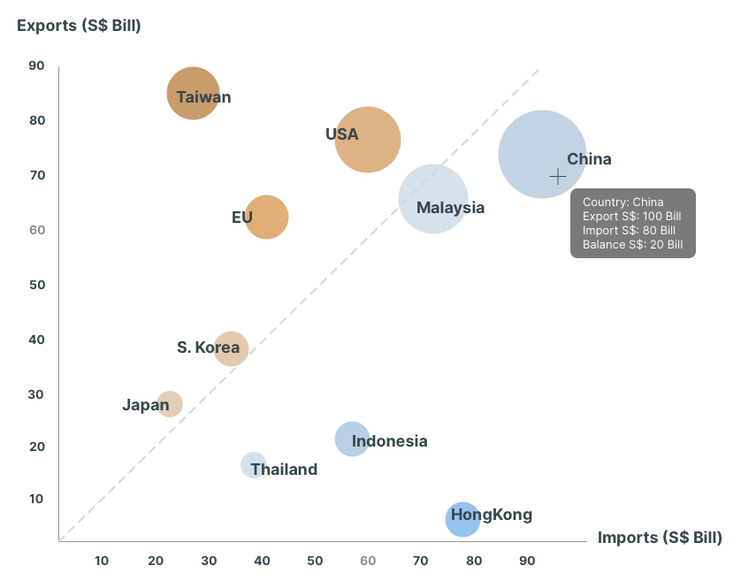
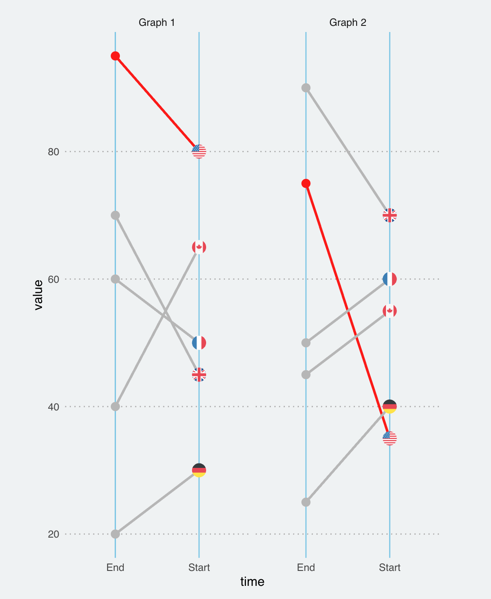

## 1 Overview

As a visual analytics novice, I will apply newly acquired techniques to explore and analyze the changing trends and patterns of Singapore’s international trade since 2015. I will be using the [data set](https://www.singstat.gov.sg/find-data/search-by-theme/trade-and-investment/merchandise-trade/latest-data) from the Department of Statistics Singapore (DOS) to re-create visualisations with critics on the visualisations shared on the [DOS website](https://www.singstat.gov.sg/modules/infographics/singapore-international-trade), and analyse the time-series events.

### 1.1 Tasks

There are 2 tasks I will complete in this assignment.

**1. Critiques on visualisations**

I will choose 3 visualisations from the Department of Statistics Singapore website that visualise the Singapore trading data and discuss their pros and cons. I will then provide sketches of improved version and use R packages to re-create the visualisations for clearer messaging.

**2. Data analysis**

I will analyse the data provided from the website with time-series analysis methods data visualisation using R packages.

### 1.2 Data

## 2 Visualisation Make-Over

The Department of Statistics Singaporepublished a series of visualisations to illustrate the Singapore international trade data on this [website](https://www.singstat.gov.sg/modules/infographics/singapore-international-trade). This assignment aims to discuss the pros and cons 3 visualisations from the 9 provided, and then provide a redesign of the charts a/o graphics to more clearly convey the insights from the dataset.

Below are the illustration of 3 plots that I will comment on and make an attempt to make over for better illustration of visualisation.

-   No. 1 is a **Comparison Bar Chart** that shows the exports and imports from the year 2020 to 2024 at the current prices.
-   No. 2 is a **Dot Plot** that illustrates Singapore's trade performance with the major trading partners.
-   No. 3 is a **Mirror Bar Chart** that attempts to illustrate several dimensions of the data, including imports and exports, year of 2019 and 2023, and by the top performing trade partners.

:::::: columns
::: {.column width="35%"}
[**#1 Bar Chart**]{style="color:#A7B49E;"}


:::

::: {.column width="35%"}
[**#2 Dot Plot**]{style="color:#A7B49E;"}


:::

::: {.column width="30%"}
[**#3 Mirror Bar Chart**]{style="color:#A7B49E;"}


:::
::::::

### 2.1 Visualisation #1

:::::: columns
::: {.column width="45%"}

:::

:::: {.column width="55%"}
::: panel-tabset
## **Pros**

The visualisation has several strengths as follows:

-   **Clear labeling for the bars:** Each bar explicitly shows its exact value (\$674.5 Bil, etc.), eliminating any guesswork about the precise figures represented.

-   **Balanced visual weight:** The imports and exports are given equal visual prominence, avoiding biasing the viewer toward one trade direction over the other.

-   **Comprehensive data presentation**: The chart manages to show five years of data with two metrics per year plus totals (15 data points) in a single, compact visualization.

## **Cons**

-   **UGLY**

🧶 **Colours -** The chart has several visual design issues that hinder its effectiveness. Primarily the colour scheme creates significant problems: each year uses a different color palette (red, yellow, blue, purple, teal), generating visual noise rather than facilitating cross-year comparisons. The colour coding makes temporal comparison difficult, while the subtle opacity differences between imports and exports provides insufficient visual distinction.

🧶 **Styling -** The shipping container is appropriate to represent Trade data, but it does not enhance understanding of the data and is not recognisable at first glance.

🧶 **Labeling -** system is also problematic. The Y axis labels for Imports and Exports use blue and green colouring. This introduces another colour dimension to an already chromatically overwhelming chart rather than clarifying the data.

-   **BAD**

The chart's structure impedes data interpretation. First, comparing the same metric across years is unnecessarily difficult as readers must visually jump between non-adjecent bars to track imports or exports over time. Second, the chart lacks clear visual hierarchy. The similar spacing between years and between categories within years, confuses their relationship. Third, the chosen format obscures temporal trends that would be immediately visible in a line chart or properly sequenced bar chart. Finally, displaying values to a decimal place (like \$674.5 billion) creates an illusion of precision that adds no meaningful information at this scale and only contributes to visual clutter.

-   **WRONG**

The "total" values, while mathematically correct, are conceptually flawed. Adding exports and imports creates a non-standard economic metric lacking clear meaning. If intended to show trade volume as an activity indicator, it should be explicitly labeled "Total Trade Volume" with context. Without this clarity, viewers might misinterpret the total as net economic benefit, when trade balance would be more meaningful.

## **Sketch**

{width="600"}

**DESIGN RATIONALE**

-   **Dumbbell plot**

    The dumbbell plot has an advantage of illustrating two sides of the trading amount and the gap between them. In this case, the plot is able to show the position of import and export for each year and observe the trends.

-   **Colors**

    2 main colors are chosen to represent Import and Export, instead of one color for each year in the original plot. The years can be easily observed in the Y axis, so there is no need to distinguish them in different colors.

-   **What were removed**
:::
::::
::::::

#### **2.1.3 Data**

The data set needed is the Maerchandise Trade data from DOS website. Within the excel file *Merchandise Trade By Commodity Section, (At Current Prices), Monthly*, there are monthly trade volumes from 1964 Jan until 2025 Jan. The value for the amount is in thousand dollars.

This means some data wrangling is needed to derive the yearly sum of the trade amount for every year from 2020 \~ 2024.

**Step 1. Load and launch packages**

```{r}
#| code-fold: True
#| code-summary: "Show the code"
library(readxl)
library(dplyr)
library(stringr)
library(knitr)
```

**Step 2. Import the data**

1\. Read the Excel file:

```{r}
#| code-fold: True
#| code-summary: "Show the code"

v1_data <- read_xlsx("data/Mtrade_commodity.xlsx", "T1")
v1_data_import <- read_xlsx("data/Mtrade_commodity.xlsx", "T3")
v1_data_export <- read_xlsx("data/Mtrade_commodity.xlsx", "T5")
head(v1_data)

```

::::: goals
::: goals-header
Observation
:::

::: goals-container
-   The reading result shows that the fields are all in character type, which needs further conversion for computation later.
:::
:::::

2.  Make a subset for further manipulation

```{r}
#| code-fold: True
#| code-summary: "Show the code"

# Make a subset of the data needed (just the total amount) - merch trade
v1_subset <- v1_data[c(10, 11),]
v1_trans_matrix <- t(v1_subset) #after transpose, the data is a matrix.
v1_trans <- as.data.frame(v1_trans_matrix) #now convert the matrix to df.

# Make a subset of the data needed (just the total amount) - Imports
v1_subset_import <- v1_data_import[c(10, 11),]
v1_trans_matrix_import <- t(v1_subset_import) #after transpose, the data is a matrix.
v1_trans_import <- as.data.frame(v1_trans_matrix_import) #now convert the matrix to df.

# Make a subset of the data needed (just the total amount) - Exports
v1_subset_export <- v1_data_export[c(10, 11),]
v1_trans_matrix_export <- t(v1_subset_export) #after transpose, the data is a matrix.
v1_trans_export <- as.data.frame(v1_trans_matrix_export) #now convert the matrix to df.

kable(head(v1_trans))
kable(head(v1_trans_import))
kable(head(v1_trans_export))

```

::::: goals
::: goals-header
Observation
:::

::: goals-container
-   The subset data has new column names, so we will need to shift the first row up to be the column names.
:::
:::::

**Step 3. Data wrangling**

In this step, I will first correct the column names. Then I will extract the years from the 1st column so I can group them to sum up the trade values. I will also need to convert the data types to numeric from character.

::: {.panel-tabset}

## Merchandise Trade

Below code is used to derive the data set for merchandise trade (import & export) yearly totals from 2020-2024.

```{r}
#| code-fold: True
#| code-summary: "Show the code"

# Correct the column name
real_column_names <- as.character(v1_trans[1, ])
colnames(v1_trans) <- real_column_names

# remove the first row
v1_trans <- v1_trans[-1, ]

# Extract year first
v1_trans$Year <- substr(v1_trans$`Data Series`, 1, 4)
v1_trans$Year <- as.numeric(v1_trans$Year)

# Convert type
v1_trans$`Total Merchandise Trade, (At Current Prices)` <- 
  as.numeric(v1_trans$`Total Merchandise Trade, (At Current Prices)`)

# This is the data frame for visual 1
v1_year_sum <- v1_trans %>%
  filter(Year >= 2020 & Year <= 2024) %>%
  group_by(Year) %>%
  summarise(
    YearTotal = sum(`Total Merchandise Trade, (At Current Prices)`, na.rm = TRUE))

head(v1_year_sum)
```

## Imports

Below code is used to derive the data set for imports yearly totals from 2020-2024.

```{r}
#| code-fold: True
#| code-summary: "Show the code"

# Correct the column name
real_column_names_im <- as.character(v1_trans_import[1, ])
colnames(v1_trans_import) <- real_column_names_im

# remove the first row
v1_trans_import <- v1_trans_import[-1, ]

# Extract year first
v1_trans_import$Year <- substr(v1_trans_import$`Data Series`, 1, 4)
v1_trans_import$Year <- as.numeric(v1_trans_import$Year)

# Convert type
v1_trans_import$`Total Merchandise Imports` <- 
  as.numeric(v1_trans_import$`Total Merchandise Imports`)

# This is the data frame for visual 1
v1_year_sum_im <- v1_trans_import %>%
  filter(Year >= 2020 & Year <= 2024) %>%
  group_by(Year) %>%
  summarise(
    YearTotal_im = sum(`Total Merchandise Imports`, na.rm = TRUE))

head(v1_year_sum_im)
```

## Exports

Below code is used to derive the data set for exports yearly totals from 2020-2024.

```{r}
#| code-fold: True
#| code-summary: "Show the code"

# Correct the column name
real_column_names_ex <- as.character(v1_trans_export[1, ])
colnames(v1_trans_export) <- real_column_names_ex

# remove the first row
v1_trans_export <- v1_trans_export[-1, ]

# Extract year first
v1_trans_export$Year <- substr(v1_trans_export$`Data Series`, 1, 4)
v1_trans_export$Year <- as.numeric(v1_trans_export$Year)

# Convert type
v1_trans_export$`Total Merchandise Exports` <- 
  as.numeric(v1_trans_export$`Total Merchandise Exports`)

# This is the data frame for visual 1
v1_year_sum_ex <- v1_trans_export %>%
  filter(Year >= 2020 & Year <= 2024) %>%
  group_by(Year) %>%
  summarise(
    YearTotal_ex = sum(`Total Merchandise Exports`, na.rm = TRUE))

head(v1_year_sum_ex)
```

:::

#### **2.1.4 Visualisation make-over**

```{r}
library(tidyverse)
library(ggtext)
library(extrafont)
```

```{.r}
# font_import()  #run once
loadfonts(device = "win") #run once per session
```

```{r}

```

### 2.2 Visualisation #2

::::::::: columns
::: {.column width="45%"}

:::

::::::: {.column width="55%"}
:::::: panel-tabset
## **Pros**

-   **Dual-color background** (blue and green) - shows which trading relationship favour imports and exports.

-   **Bubble size** - The bubble size visually represent total trade volume, which makes it easy to identify Singapore's most significant partner at a glance.

-   **Labeling** - The labeling for each country provides the name and its total trade volume so viewers can easily retrieve the information.

-   **Footnote** - It has also included an explanatory note to clarify how to interpret the bubble positions relative to the diagnol dividing line.

## **Cons**

**UGLY**

-   **Color** - Similar to Visualisation #1, the color scheme lacks cohesion. Each country has a different color without any apparent system or logic. Although at first glance it looks colorful, it has added noise rather than enhaning understanding.

-   **Labeling** - Although the labels provide useful information, they altogether make the chart unnecessary clutter looking. The positioning and spacing relative to their bubbles are inconsistent and look random.

**BAD**

-   The explanatory text at the bottom is lengthy and could be simplified or converted to visual elements for quicker comprehension.

-   The footnote states that viewer can use the centre point (white circle) of the bubble to determine whether Singapore has deficit or surplus with the trading partner, but lacking coloring opacity made it hard to achieve this.

::::: columns
::: {.column width="60%"}
**WRONG**

-   Labeling - On the website, the lables for X axis and Y axis are in confusing positions where viewer might misunderstand the x axis as Imports and y as Exports, as it is against the normal axis labeling convention. This issue does not appear in the PDF file for download.
:::

::: {.column width="40%"}

:::
:::::

## **Sketch**

{width="700"}
::::::
:::::::
:::::::::

#### **2.2.3 Data**

#### **2.2.4 Visualisation make-over**

### 2.3 Visualisation #3

:::::: columns
::: {.column width="45%"}

:::

:::: {.column width="55%"}
::: panel-tabset
## **Pros**

## **Cons**

## **Sketch**


:::
::::
::::::

#### **2.3.3 Data**

#### **2.3.4 Visualisation make-over**

### 2.4 Summary

## 3 Singapore Merchandise Trade Data Analysis

Analyse the data with either time-series analysis or time-series forecasting methods by compliment the analysis with appropriate data visualisation methods and R packages.

### 3.1 Objectives

### 3.2 Data

3.2.1 Data wrangling

3.2.2

### 3.3 Analysis

visualisation methods, analysis results (500 words)

## 4 Conclusion

## Reference

::::::
