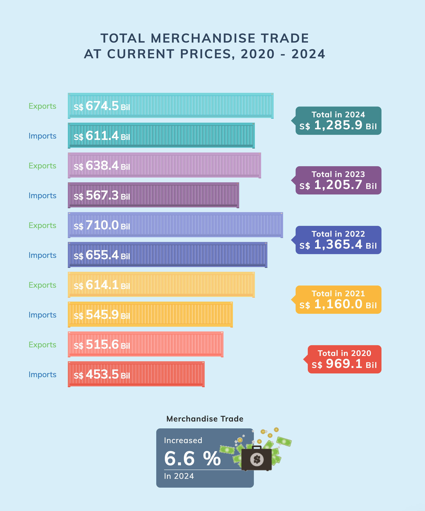

## 1 Overview

As a visual analytics novice, I will apply newly acquired techniques to explore and analyze the changing trends and patterns of Singapore’s international trade since 2015. I will be using the [data set](https://www.singstat.gov.sg/find-data/search-by-theme/trade-and-investment/merchandise-trade/latest-data) from the Department of Statistics Singapore (DOS) to re-create visualisations with critics on the visualisations shared on the [DOS website](https://www.singstat.gov.sg/modules/infographics/singapore-international-trade), and analyse the time-series events.

### 1.1 Tasks

There are 2 tasks I will complete in this assignment.

**1. Critiques on visualisations**

I will choose 3 visualisations from the Department of Statistics Singapore website that visualise the Singapore trading data and discuss their pros and cons. I will then provide sketches of improved version and use R packages to re-create the visualisations for clearer messaging.

**2. Data analysis**

I will analyse the data provided from the website with time-series analysis methods data visualisation using R packages.

### 1.2 Data

## 2 Visualisation Make-Over

The Department of Statistics Singaporepublished a series of visualisations to illustrate the Singapore international trade data on this [website](https://www.singstat.gov.sg/modules/infographics/singapore-international-trade). This assignment aims to discuss the pros and cons 3 visualisations from the 9 provided, and then provide a redesign of the charts a/o graphics to more clearly convey the insights from the dataset.

Below are the illustration of 3 plots that I will comment on and make an attempt to make over for better illustration of visualisation.

-   No. 1 is a **Comparison Bar Chart** that shows the exports and imports from the year 2020 to 2024 at the current prices.
-   No. 2 is a **Dot Plot** that illustrates Singapore's trade performance with the major trading partners.
-   No. 3 is a **Mirror Bar Chart** that attempts to illustrate several dimensions of the data, including imports and exports, year of 2019 and 2023, and by the top performing trade partners.

::::: columns
::: {.column width="42%"}
### [1. Bar Chart]{style="color:#F37199;"}


### [2. Dot Plot]{style="color:#F37199;"}


:::

::: {.column width="58%"}
### [3. Mirror Bar Chart]{style="color:#F37199;"}


:::
:::::

### 2.1 Visualisation #1

:::::::: panel-tabset
## **Pros**

The visualisation has several strengths as follows:

-   **Clear labeling for the bars:** Each bar explicitly shows its exact value (\$674.5 Bil, etc.), eliminating any guesswork about the precise figures represented.

-   **Balanced visual weight:** The imports and exports are given equal visual prominence, avoiding biasing the viewer toward one trade direction over the other.

-   **Comprehensive data presentation**: The chart manages to show five years of data with two metrics per year plus totals (15 data points) in a single, compact visualization.

## **Cons**

-   **UGLY**

🧶 **Colours -** The chart has several visual design issues that hinder its effectiveness. Primarily the colour scheme creates significant problems: each year uses a different color palette (red, yellow, blue, purple, teal), generating visual noise rather than facilitating cross-year comparisons. The colour coding makes temporal comparison difficult, while the subtle opacity differences between imports and exports provides insufficient visual distinction.

🧶 **Styling -** The shipping container is appropriate to represent Trade data, but it does not enhance understanding of the data and is not recognisable at first glance.

🧶 **Labeling -** system is also problematic. The Y axis labels for Imports and Exports use blue and green colouring. This introduces another colour dimension to an already chromatically overwhelming chart rather than clarifying the data.

-   **BAD**

The chart's structure impedes data interpretation. First, comparing the same metric across years is unnecessarily difficult as readers must visually jump between non-adjecent bars to track imports or exports over time. Second, the chart lacks clear visual hierarchy. The similar spacing between years and between categories within years, confuses their relationship. Third, the chosen format obscures temporal trends that would be immediately visible in a line chart or properly sequenced bar chart. Finally, displaying values to a decimal place (like \$674.5 billion) creates an illusion of precision that adds no meaningful information at this scale and only contributes to visual clutter.

-   **WRONG**

The "total" values, while mathematically correct, are conceptually flawed. Adding exports and imports creates a non-standard economic metric lacking clear meaning. If intended to show trade volume as an activity indicator, it should be explicitly labeled "Total Trade Volume" with context. Without this clarity, viewers might misinterpret the total as net economic benefit, when trade balance would be more meaningful.

## **Sketch**

**DESIGN RATIONALE**

-   **Dumbbell plot**

    The dumbbell plot has an advantage of illustrating two sides of the trading amount and the gap between them. In this case, the plot is able to show the position of import and export for each year and observe the trends.

-   **Colors**

    2 main colors are chosen to represent Import and Export, instead of one color for each year in the original plot. The years can be easily observed in the Y axis, so there is no need to distinguish them in different colors.

-   **What were removed**

::::: columns
::: {.column width="37%"}
[**BEFORE**]{style="color:#F37199;"}

:::

::: {.column width="3%"}
:::

::: {.column width="60%"}
[**AFTER**]{style="color:#F37199;"}
{width="600"}
:::
:::::
:::::::: 

#### **2.1.3 Data**

#### **2.1.4 Visualisation make-over**

### 2.2 Visualisation #2

::: panel-tabset
## **Pros**

## **Cons**

{width="500"}

## **Sketch**
:::

#### 

#### **2.2.3 Data**

#### **2.2.4 Visualisation make-over**

### 2.3 Visualisation #3

::: panel-tabset
## **Pros**

## **Cons**

## **Sketch**
:::

#### **2.3.3 Data**

```{r}
devtools::install_github('rensa/ggflags')

#load packages
library(tidyverse)
library(ggflags) 
library(countrycode) # to convert country names to country codes
library(tidytext) # for reorder_within
library(scales) # for application of common formats to scale labels (e.g., comma, percent, dollar)

```


```{r}
#| fig-width: 4
#| fig-height: 6
#| code-fold: true
#| code-summary: "Show the code"

library(ggplot2)
library(ggiraph)
library(dplyr)
library(tidyr)

# Create sample data
data1 <- data.frame(
  id = LETTERS[1:5],
  left = c(80, 65, 45, 30, 50),
  right = c(95, 40, 70, 20, 60)
)

data2 <- data.frame(
  id = LETTERS[1:5],
  left = c(35, 55, 70, 40, 60),
  right = c(75, 45, 90, 25, 50)
)

# Add graph identifiers
data1$graph <- "Graph 1"
data2$graph <- "Graph 2"

# Combine data and convert to long format
combined_data <- rbind(data1, data2) %>%
  pivot_longer(cols = c(left, right), 
               names_to = "position", 
               values_to = "value")

# Create the plot with ggiraph
p <- ggplot(combined_data, aes(x = position, y = value, group = id, color = id)) +
  geom_line_interactive(aes(tooltip = id, data_id = id), size = 0.5) +
  geom_point_interactive(aes(tooltip = paste0(id, ": ", value), data_id = id), size = 1) +
  facet_wrap(~graph, scales = "free_x") +
  scale_color_brewer(palette = "Set1") +
  theme_minimal() +
  labs(title = "Interactive Slopegraphs", x = "", y = "Value") +
  theme(legend.position = "none")

girafe(ggobj = p, width_svg = 5, height_svg = 7) %>%
  girafe_options(
    opts_sizing(rescale = FALSE),
    opts_hover(css = "stroke-width:3px;"),
    opts_hover_inv(css = "opacity:0.2;"),
    opts_selection(type = "single", only_shiny = FALSE)
  ) 

```
```{r}
library(ggplot2)
library(ggiraph)
library(dplyr)

# Create data in long format
data1 <- rbind(
  data.frame(id = LETTERS[1:5], time = "Start", value = c(80, 65, 45, 30, 50), graph = "Graph 1"),
  data.frame(id = LETTERS[1:5], time = "End", value = c(95, 40, 70, 20, 60), graph = "Graph 1")
)

data2 <- rbind(
  data.frame(id = LETTERS[1:5], time = "Start", value = c(35, 55, 70, 40, 60), graph = "Graph 2"),
  data.frame(id = LETTERS[1:5], time = "End", value = c(75, 45, 90, 25, 50), graph = "Graph 2")
)

combined_data <- rbind(data1, data2)

# Create interactive plot
p <- ggplot(combined_data, aes(x = time, y = value, group = id, color = id)) +
  geom_line_interactive(aes(data_id = id), size = 1) +
  geom_point_interactive(aes(data_id = id, tooltip = paste0(id, ": ", value)), size = 3) +
  geom_text_interactive(data = subset(combined_data, time == "Start"), 
                        aes(label = id, data_id = id), hjust = 1.5) +
  facet_wrap(~graph, scales = "free_x") +
  scale_color_brewer(palette = "Set1") +
  theme_minimal() +
  theme(legend.position = "none")

girafe(ggobj = p, width_svg = 4, height_svg = 5) %>%
  girafe_options(
        opts_sizing(rescale = FALSE),
    opts_hover(css = "stroke-width:3px;"),
    opts_hover_inv(css = "opacity:0.2;")
  )
```
```{r}
library(ggflags)

# Add country codes to your data
data1$code <- c("us", "ca", "gb", "de", "fr")
data2$code <- c("us", "ca", "gb", "de", "fr")
combined_data <- rbind(data1, data2)

# Create interactive plot with flags
p <- ggplot(combined_data, aes(x = time, y = value, group = id, color = id)) +
  geom_line_interactive(aes(data_id = id), size = 1) +
  geom_point_interactive(aes(data_id = id, tooltip = paste0(id, ": ", value)), size = 3) +
  # Add country flags
  geom_flag(data = subset(combined_data, time == "Start"), 
           aes(country = code), size = 5, hjust = 2.2) +
  facet_wrap(~graph, scales = "free_x") +
  scale_color_brewer(palette = "Set1") +
  theme_minimal() +
  theme(legend.position = "none")

girafe(ggobj = p)
```


#### **2.3.4 Visualisation make-over**

### 2.4 Summary

## 3 Singapore Merchandise Trade Data Analysis

Analyse the data with either time-series analysis or time-series forecasting methods by compliment the analysis with appropriate data visualisation methods and R packages.

### 3.1 Objectives

### 3.2 Data

3.2.1 Data wrangling

3.2.2

### 3.3 Analysis

visualisation methods, analysis results (500 words)

## 4 Conclusion

## Reference
::::::::
